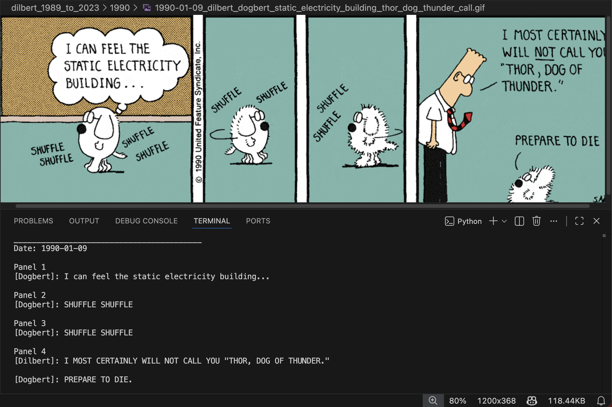

# Dilbert Strip Transcriber
Work-in-progress project to transcribe Dilbert comic strips using local models...

Current progress:
- Collected strips from Internet Archive (1989–2023)
- Implemented whitespace based panel splitting using OpenCV
- Passed compressed images through a Vision Language Model and extracted transcribed outputs
- Computed accuracy figures for different models and made a tabular analysis.

### Average Accuracy Comparison (All Models)

| Model | Preprocessing | Panel Detection Acc | Speaker Attribution Acc | OCR Acc |
|---|---|---|---|---|
| Qwen 7B | - | 94.7% | 66.0% | 99.9% |
| Qwen 7B | Yes | 100% | 71.0% | 99.5% |
| InternVL 8B | - | 94.35% | 45.43% | 74.40% |
| InternVL 8B | Yes | 100% | 69.9% | 98.92% |
| **LLaVA 13B** | - | — | — | — |
| **LLaVA 13B** | Yes | 100% | 45% | 86.7% |

---

## Accuracy Calculation Rules Used

- Panel Acc = min(#Panels_GT, #Panels_Pred) / max(#Panels_GT, #Panels_Pred)
- Speaker Acc = #Correct_Speaker_Assignments / #GT_Dialogue_Lines
- OCR Acc = #Correct_Characters / #GT_Characters

(where GT = Ground Truth, Pred = Predictions)

---

## Final Evaluation Table - Qwen7B (No Preprocessing)

| Date | Panels (GT/Pred) | Panel Acc | Speaker Acc | OCR Acc |
|------|------------------|-----------|-------------|---------|
| 1990-01-01 | 3 / 3 | 1.00 | 0.75 (3/4) | 1.00 |
| 1990-01-02 | 3 / 3 | 1.00 | 0.75 (3/4) | 1.00 |
| 1990-01-03 | 3 / 5 | 0.60 | 0.80 (4/5) | 1.00 |
| 1990-01-04 | 3 / 3 | 1.00 | 0.60 (3/5) | 1.00 |
| 1990-01-05 | 3 / 3 | 1.00 | 0.75 (3/4) | 0.99 |
| 1990-01-06 | 3 / 3 | 1.00 | 0.60 (3/5) | 1.00 |
| 1990-01-07 | 6 / 6 | 1.00 | 0.33 (3/9) | 1.00 |
| 1990-01-08 | 3 / 3 | 1.00 | 1.00 (5/5) | 1.00 |
| 1990-01-09 | 4 / 4 | 1.00 | 1.00 (5/5) | 1.00 |
| 1990-01-10 | 3 / 3 | 1.00 | 0.33 (1/3) | 1.00 |
| 1990-01-11 | 3 / 3 | 1.00 | 0.67 (2/3) | 1.00 |
| 1990-01-12 | 3 / 3 | 1.00 | 0.60 (3/5) | 1.00 |
| 1990-01-13 | 3 / 5 | 0.60 | 0.60 (3/5) | 1.00 |
| 1990-01-14 | 5 / 8 | 0.63 | 0.625 (5/8) | 1.00 |
| 1990-01-15 | 3 / 3 | 1.00 | 1.00 (6/6) | 1.00 |
| 1990-01-16 | 3 / 3 | 1.00 | 1.00 (5/5) | 1.00 |
| 1990-01-17 | 3 / 3 | 1.00 | 0.75 (3/4) | 1.00 |
| 1990-01-18 | 3 / 3 | 1.00 | 1.00 (3/3) | 1.00 |
| 1990-01-19 | 3 / 3 | 1.00 | 0.75 (3/4) | 1.00 |
| 1990-01-20 | 3 / 3 | 1.00 | 1.00 (4/4) | 1.00 |
| 1990-01-21 | 6 / 7 | 0.86 | 0.57 (4/7) | 1.00 |
| 1990-01-22 | 2 / 4 | 0.50 | 0.75 (3/4) | 1.00 |
| 1990-01-23 | 3 / 3 | 1.00 | 0.00 (0/3) | 1.00 |
| 1990-01-24 | 3 / 3 | 1.00 | 1.00 (3/3) | 1.00 |
| 1990-01-25 | 3 / 3 | 1.00 | 0.40 (2/5) | 1.00 |
| 1990-01-26 | 3 / 3 | 1.00 | 0.75 (3/4) | 1.00 |
| 1990-01-27 | 3 / 3 | 1.00 | 1.00 (5/5) | 1.00 |
| 1990-01-28 | 6 / 7 | 0.86 | 0.29 (2/7) | 1.00 |
| 1990-01-29 | 3 / 3 | 1.00 | 0.75 (3/4) | 1.00 |
| 1990-01-30 | 3 / 3 | 1.00 | 0.75 (3/4) | 1.00 |
| 1990-01-31 | 3 / 5 | 0.60 | 0.17 (1/6) | 0.99 |
| 1990-02-01 | 3 / 3 | 1.00 | 0.00 (0/3) | 1.00 |
| 1990-02-02 | 3 / 3 | 1.00 | 0.60 (3/5) | 1.00 |
| 1990-02-03 | 3 / 3 | 1.00 | 1.00 (5/5) | 1.00 |
| 1990-02-04 | 5 / 6 | 0.83 | 0.57 (4/7) | 1.00 |
| 1990-02-05 | 3 / 3 | 1.00 | 1.00 (3/3) | 1.00 |
| 1990-02-06 | 3 / 3 | 1.00 | 0.25 (1/4) | 1.00 |
| 1990-02-07 | 3 / 3 | 1.00 | 0.00 (0/3) | 1.00 |
| 1990-02-08 | 3 / 3 | 1.00 | 0.67 (2/3) | 1.00 |
| 1990-02-09 | 3 / 3 | 1.00 | 0.50 (2/4) | 1.00 |

## Averages
- **Panel Detection Accuracy:** 94.7%
- **Speaker Attribution Accuracy:** 66%
- **OCR Accuracy:** 99.9%

---

## Final Evaluation Table - Qwen7B (Preprocessed)

| Date | Panels (GT/Pred) | Panel Acc | Speaker Acc | OCR Acc |
|---|---|---|---|---|
| 1990-01-01 | 3 / 3 | 1.00 | 0.75 (3/4) | 1.00 |
| 1990-01-02 | 3 / 3 | 1.00 | 0.75 (3/4) | 1.00 |
| 1990-01-03 | 3 / 3 | 1.00 | 0.75 (3/4) | 1.00 |
| 1990-01-04 | 3 / 3 | 1.00 | 1.00 (5/5) | 1.00 |
| 1990-01-05 | 3 / 3 | 1.00 | 0.75 (3/4) | 1.00 |
| 1990-01-06 | 3 / 3 | 1.00 | 1.00 (5/5) | 1.00 |
| 1990-01-07 | 6 / 6 | 1.00 | 0.43 (3/7) | 1.00 |
| 1990-01-08 | 3 / 3 | 1.00 | 0.80 (4/5) | 1.00 |
| 1990-01-09 | 4 / 4 | 1.00 | 1.00 (5/5) | 1.00 |
| 1990-01-10 | 3 / 3 | 1.00 | 0.33 (1/3) | 1.00 |
| 1990-01-11 | 3 / 3 | 1.00 | 1.00 (2/2) | 1.00 |
| 1990-01-12 | 3 / 3 | 1.00 | 0.60 (3/5) | 1.00 |
| 1990-01-13 | 3 / 3 | 1.00 | 0.40 (2/5) | 1.00 |
| 1990-01-14 | 5 / 5 | 1.00 | 0.83 (5/6) | 0.77 |
| 1990-01-15 | 3 / 3 | 1.00 | 0.83 (5/6) | 1.00 |
| 1990-01-16 | 3 / 3 | 1.00 | 1.00 (5/5) | 1.00 |
| 1990-01-17 | 3 / 3 | 1.00 | 0.25 (1/4) | 1.00 |
| 1990-01-18 | 3 / 3 | 1.00 | 0.33 (1/3) | 1.00 |
| 1990-01-19 | 3 / 3 | 1.00 | 0.75 (3/4) | 1.00 |
| 1990-01-20 | 3 / 3 | 1.00 | 1.00 (4/4) | 1.00 |
| 1990-01-21 | 6 / 6 | 1.00 | 0.86 (6/7) | 0.96 |
| 1990-01-22 | 2 / 2 | 1.00 | 0.67 (2/3) | 1.00 |
| 1990-01-23 | 3 / 3 | 1.00 | 1.00 (3/3) | 1.00 |
| 1990-01-24 | 3 / 3 | 1.00 | 1.00 (3/3) | 1.00 |
| 1990-01-25 | 3 / 3 | 1.00 | 0.40 (2/5) | 1.00 |
| 1990-01-26 | 3 / 3 | 1.00 | 0.50 (2/4) | 1.00 |
| 1990-01-27 | 3 / 3 | 1.00 | 1.00 (5/5) | 1.00 |
| 1990-01-28 | 6 / 6 | 1.00 | 0.43 (3/7) | 1.00 |
| 1990-01-29 | 3 / 3 | 1.00 | 0.75 (3/4) | 1.00 |
| 1990-01-30 | 3 / 3 | 1.00 | 0.50 (2/4) | 1.00 |
| 1990-01-31 | 3 / 3 | 1.00 | 1.00 (5/5) | 1.00 |
| 1990-02-01 | 3 / 3 | 1.00 | 0.00 (0/3) | 1.00 |
| 1990-02-02 | 3 / 3 | 1.00 | 0.60 (3/5) | 1.00 |
| 1990-02-03 | 3 / 3 | 1.00 | 1.00 (5/5) | 1.00 |
| 1990-02-04 | 5 / 5 | 1.00 | 1.00 (7/7) | 1.00 |
| 1990-02-05 | 3 / 3 | 1.00 | 0.00 (0/3) | 1.00 |
| 1990-02-06 | 3 / 3 | 1.00 | 0.50 (2/4) | 1.00 |
| 1990-02-07 | 3 / 3 | 1.00 | 0.67 (2/3) | 1.00 |
| 1990-02-08 | 3 / 3 | 1.00 | 0.67 (2/3) | 1.00 |
| 1990-02-09 | 3 / 3 | 1.00 | 0.33 (1/3) | 1.00 |

## Averages
- **Panel Detection Accuracy:** ~ 100%
- **Speaker Attribution Accuracy:** ~71%
- **OCR Accuracy:** ~99.5%

---

## Final Evaluation Table - InternVL 8B (No Preprocessing)

| Date | Panels (GT/Pred) | Panel Acc | Speaker Acc | OCR Acc |
|------|------------------|-----------|-------------|---------|
| 1990-01-01 | 3 / 3 | 1.00 | 0.50 (2/4) | 0.65 |
| 1990-01-02 | 3 / 3 | 1.00 | 0.25 (1/4) | 0.79 |
| 1990-01-03 | 3 / 3 | 1.00 | 0.75 (3/4) | 0.81 |
| 1990-01-04 | 3 / 3 | 1.00 | 0.60 (3/5) | 0.84 |
| 1990-01-05 | 3 / 3 | 1.00 | 0.75 (3/4) | 0.51 |
| 1990-01-06 | 3 / 4 | 0.75 | 0.40 (2/5) | 0.88 |
| 1990-01-07 | 6 / 6 | 1.00 | 0.43 (3/7) | 0.64 |
| 1990-01-08 | 3 / 3 | 1.00 | 0.40 (2/5) | 0.60 |
| 1990-01-09 | 4 / 4 | 1.00 | 0.50 (3/6) | 0.67 |
| 1990-01-10 | 3 / 3 | 1.00 | 1.00 (3/3) | 0.90 |
| 1990-01-11 | 3 / 3 | 1.00 | 0.50 (1/2) | 1.00 |
| 1990-01-12 | 3 / 3 | 1.00 | 0.20 (1/5) | 0.80 |
| 1990-01-13 | 3 / 4 | 0.75 | 0.40 (2/5) | 0.72 |
| 1990-01-14 | 5 / 6 | 0.83 | 1.00 (5/5) | 0.72 |
| 1990-01-15 | 3 / 4 | 0.75 | 0.33 (2/6) | 0.89 |
| 1990-01-16 | 3 / 3 | 1.00 | 0.60 (3/5) | 0.92 |
| 1990-01-17 | 3 / 3 | 1.00 | 0.50 (2/4) | 0.71 |
| 1990-01-18 | 3 / 3 | 1.00 | 0.67 (2/3) | 0.87 |
| 1990-01-19 | 3 / 3 | 1.00 | 0.50 (2/4) | 0.77 |
| 1990-01-20 | 3 / 3 | 1.00 | 0.75 (3/4) | 0.90 |
| 1990-01-21 | 6 / 6 | 1.00 | 0.14 (1/7) | 0.39 |
| 1990-01-22 | 2 / 4 | 0.50 | 0.33 (1/3) | 0.83 |
| 1990-01-23 | 3 / 3 | 1.00 | 0.00 (0/3) | 0.79 |
| 1990-01-24 | 3 / 3 | 1.00 | 0.67 (2/3) | 0.93 |
| 1990-01-25 | 3 / 3 | 1.00 | 0.20 (1/5) | 0.70 |
| 1990-01-26 | 3 / 3 | 1.00 | 0.50 (2/4) | 0.74 |
| 1990-01-27 | 3 / 3 | 1.00 | 0.20 (1/5) | 0.52 |
| 1990-01-28 | 6 / 7 | 0.86 | 0.57 (4/7) | 0.50 |
| 1990-01-29 | 3 / 3 | 1.00 | 0.25 (1/4) | 0.81 |
| 1990-01-30 | 3 / 3 | 1.00 | 0.50 (2/4) | 0.85 |
| 1990-01-31 | 3 / 3 | 1.00 | 0.00 (0/5) | 0.50 |
| 1990-02-01 | 3 / 3 | 1.00 | 0.67 (2/3) | 0.76 |
| 1990-02-02 | 3 / 4 | 0.75 | 0.00 (0/5) | 0.68 |
| 1990-02-03 | 3 / 3 | 1.00 | 0.40 (2/5) | 0.61 |
| 1990-02-04 | 5 / 4 | 0.80 | 0.29 (2/7) | 0.56 |
| 1990-02-05 | 3 / 3 | 1.00 | 0.67 (2/3) | 0.86 |
| 1990-02-06 | 3 / 4 | 0.75 | 0.50 (2/4) | 0.88 |
| 1990-02-07 | 3 / 3 | 1.00 | 0.00 (0/3) | 0.73 |
| 1990-02-08 | 3 / 3 | 1.00 | 1.00 (3/3) | 0.82 |
| 1990-02-09 | 3 / 3 | 1.00 | 0.25 (1/4) | 0.71 |

## Averages
- **Panel Detection Accuracy:**  94.35%
- **Speaker Attribution Accuracy:**  45.43%
- **OCR Accuracy:**  74.40%

---

## Final Evaluation Table - InternVL 8B (Preprocessed)

| Date | Panels (GT/Pred) | Panel Acc | Speaker Acc | OCR Acc |
|---|---|---|---|---|
| 1990-01-01 | 3 / 3 | 1.00 | 0.75 (3/4) | 1.00 |
| 1990-01-02 | 3 / 3 | 1.00 | 1.00 (4/4) | 0.995 |
| 1990-01-03 | 3 / 3 | 1.00 | 0.20 (1/5) | 0.98 |
| 1990-01-04 | 3 / 3 | 1.00 | 0.60 (3/5) | 0.972 |
| 1990-01-05 | 3 / 3 | 1.00 | 1.00 (4/4) | 0.995 |
| 1990-01-06 | 3 / 3 | 1.00 | 0.60 (3/5) | 1.00 |
| 1990-01-07 | 6 / 6 | 1.00 | 0.29 (2/7) | 0.991 |
| 1990-01-08 | 3 / 3 | 1.00 | 1.00 (5/5) | 0.992 |
| 1990-01-09 | 4 / 4 | 1.00 | 1.00 (5/5) | 1.00 |
| 1990-01-10 | 3 / 3 | 1.00 | 0.67 (2/3) | 0.993 |
| 1990-01-11 | 3 / 3 | 1.00 | 1.00 (2/2) | 1.00 |
| 1990-01-12 | 3 / 3 | 1.00 | 0.60 (3/5) | 1.00 |
| 1990-01-13 | 3 / 3 | 1.00 | 0.40 (2/5) | 0.992 |
| 1990-01-14 | 5 / 5 | 1.00 | 0.60 (3/5) | 0.996 |
| 1990-01-15 | 3 / 3 | 1.00 | 0.83 (5/6) | 0.997 |
| 1990-01-16 | 3 / 3 | 1.00 | 1.00 (5/5) | 0.996 |
| 1990-01-17 | 3 / 3 | 1.00 | 0.75 (3/4) | 1.00 |
| 1990-01-18 | 3 / 3 | 1.00 | 1.00 (3/3) | 0.993 |
| 1990-01-19 | 3 / 3 | 1.00 | 0.60 (3/5) | 0.75 |
| 1990-01-20 | 3 / 3 | 1.00 | 0.75 (3/4) | 1.00 |
| 1990-01-21 | 6 / 6 | 1.00 | 1.00 (6/6) | 1.00 |
| 1990-01-22 | 2 / 2 | 1.00 | 0.33 (1/3) | 1.00 |
| 1990-01-23 | 3 / 3 | 1.00 | 1.00 (3/3) | 1.00 |
| 1990-01-24 | 3 / 3 | 1.00 | 1.00 (3/3) | 0.993 |
| 1990-01-25 | 3 / 3 | 1.00 | 0.60 (3/5) | 1.00 |
| 1990-01-26 | 3 / 3 | 1.00 | 0.75 (3/4) | 0.995 |
| 1990-01-27 | 3 / 3 | 1.00 | 0.00 (0/5) | 0.996 |
| 1990-01-28 | 6 / 6 | 1.00 | 0.86 (6/7) | 0.997 |
| 1990-01-29 | 3 / 3 | 1.00 | 0.75 (3/4) | 0.99 |
| 1990-01-30 | 3 / 3 | 1.00 | 0.50 (2/4) | 1.00 |
| 1990-01-31 | 3 / 3 | 1.00 | 0.80 (4/5) | 1.00 |
| 1990-02-01 | 3 / 3 | 1.00 | 1.00 (3/3) | 1.00 |
| 1990-02-02 | 3 / 3 | 1.00 | 0.80 (4/5) | 1.00 |
| 1990-02-03 | 3 / 3 | 1.00 | 0.80 (4/5) | 0.988 |
| 1990-02-04 | 5 / 5 | 1.00 | 0.86 (6/7) | 1.00 |
| 1990-02-05 | 3 / 3 | 1.00 | 0.00 (0/3) | 0.987 |
| 1990-02-06 | 3 / 3 | 1.00 | 0.60 (3/5) | 1.00 |
| 1990-02-07 | 3 / 3 | 1.00 | 0.67 (2/3) | 1.00 |
| 1990-02-08 | 3 / 3 | 1.00 | 0.33 (1/3) | 1.00 |
| 1990-02-09 | 3 / 3 | 1.00 | 0.67 (2/3) | 0.98 |

## Averages
- **Panel Detection Accuracy:**  100%
- **Speaker Attribution Accuracy:**  69.9%
- **OCR Accuracy:**  98.92%

---

## Final Evaluation Table - LLaVA 13B (No Preprocessing)

| Date       | Panels (GT/Pred) | Panel Acc | Speaker Acc     | OCR Acc |
|------------|------------------|-----------|------------------|---------|
| 1990-01-01 | 3 / 3            | 1.00      | 0.50 (2/4)      | 0.98    |
| 1990-01-02 | 3 / 3            | 1.00      | 0.75 (3/4)      | 0.82    |
| 1990-01-03 | 3 / 3            | 1.00      | 0.60 (3/5)      | 0.76    |
| 1990-01-04 | 3 / 3            | 1.00      | 0.00 (0/5)      | 0.92    |
| 1990-01-05 | 3 / 3            | 1.00      | 0.75 (3/4)      | 0.89    |
| 1990-01-06 | 3 / 3            | 1.00      | 0.20 (1/5)      | 0.81    |
| 1990-01-07 | 6 / 6            | 1.00      | 0.25 (2/8)      | 0.76    |
| 1990-01-08 | 3 / 3            | 1.00      | 0.60 (3/5)      | 0.72    |
| 1990-01-09 | 4 / 4            | 1.00      | 1.00 (5/5)      | 1.00    |
| 1990-01-10 | 3 / 3            | 1.00      | 0.33 (1/3)      | 0.94    |
| 1990-01-11 | 3 / 3            | 1.00      | 1.00 (2/2)      | 0.94    |
| 1990-01-12 | 3 / 3            | 1.00      | 0.60 (3/5)      | 0.92    |
| 1990-01-13 | 3 / 3            | 1.00      | 0.17 (1/6)      | 0.74    |
| 1990-01-14 | 5 / 5            | 1.00      | 0.83 (5/6)      | 0.94    |
| 1990-01-15 | 3 / 3            | 1.00      | 0.29 (2/7)      | 0.41    |
| 1990-01-16 | 3 / 3            | 1.00      | 0.60 (3/5)      | 0.96    |
| 1990-01-17 | 3 / 3            | 1.00      | 0.20 (1/5)      | 0.90    |
| 1990-01-18 | 3 / 3            | 1.00      | 0.33 (1/3)      | 0.97    |
| 1990-01-19 | 3 / 3            | 1.00      | 0.50 (2/4)      | 0.65    |
| 1990-01-20 | 3 / 3            | 1.00      | 0.50 (2/4)      | 0.85    |
| 1990-01-21 | 6 / 6            | 1.00      | 0.43 (3/7)      | 1.00    |
| 1990-01-22 | 2 / 2            | 1.00      | 0.33 (1/3)      | 0.50    |
| 1990-01-23 | 3 / 3            | 1.00      | 0.00 (0/3)      | 1.00    |
| 1990-01-24 | 3 / 3            | 1.00      | 1.00 (3/3)      | 1.00    |
| 1990-01-25 | 3 / 3            | 1.00      | 0.20 (1/5)      | 0.94    |
| 1990-01-26 | 3 / 3            | 1.00      | 0.50 (2/4)      | 1.00    |
| 1990-01-27 | 3 / 3            | 1.00      | 0.67 (4/6)      | 0.94    |
| 1990-01-28 | 6 / 6            | 1.00      | 0.14 (1/7)      | 0.94    |
| 1990-01-29 | 3 / 3            | 1.00      | 0.50 (2/4)      | 0.55    |
| 1990-01-30 | 3 / 3            | 1.00      | 0.25 (1/4)      | 0.70    |
| 1990-01-31 | 3 / 3            | 1.00      | 0.60 (3/5)      | 1.00    |
| 1990-02-01 | 3 / 3            | 1.00      | 0.00 (0/3)      | 1.00    |
| 1990-02-02 | 3 / 3            | 1.00      | 0.20 (1/5)      | 0.84    |
| 1990-02-03 | 3 / 3            | 1.00      | 1.00 (5/5)      | 0.83    |
| 1990-02-04 | 4 / 4            | 1.00      | 0.29 (2/7)      | 0.72    |
| 1990-02-05 | 3 / 3            | 1.00      | 0.75 (3/4)      | 0.88    |
| 1990-02-06 | 3 / 3            | 1.00      | 0.25 (1/4)      | 0.95    |
| 1990-02-07 | 3 / 3            | 1.00      | 0.00 (0/3)      | 0.97    |
| 1990-02-08 | 3 / 3            | 1.00      | 0.33 (1/3)      | 1.00    |
| 1990-02-09 | 3 / 3            | 1.00      | 0.33 (1/3)      | 0.67    |

## Averages
- **Panel Detection Accuracy:**  100%
- **Speaker Attribution Accuracy:**  45%
- **OCR Accuracy:**  86.7%

---

## Final Evaluation Table - LLaVA 13B (Preprocessed)

## Averages
- **Panel Detection Accuracy:**  %
- **Speaker Attribution Accuracy:**  %
- **OCR Accuracy:**  %

---

## Transcription Examples

