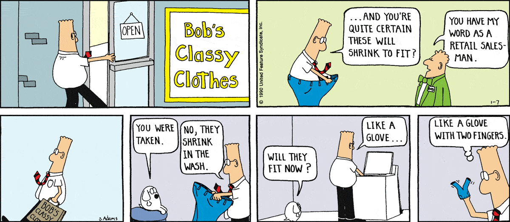
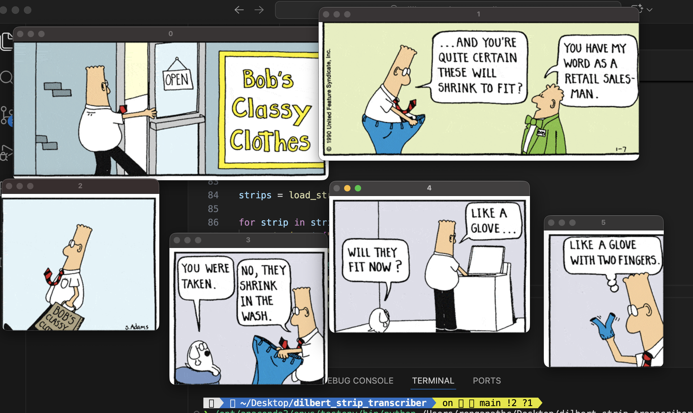

# Dilbert Strip Transcriber
Work-in-progress project to transcribe Dilbert comic strips using local models...

Current progress:
- Collected strips from the Internet Archive (1989–2023)
- Implemented whitespace based panel splitting using OpenCV

## Example

**Original strip**

**Panels after splitting**

Next steps:
- Integrate local OCR and add character presence and speaker logic
